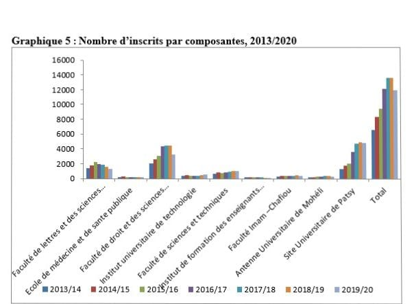
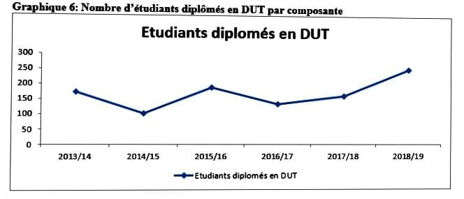
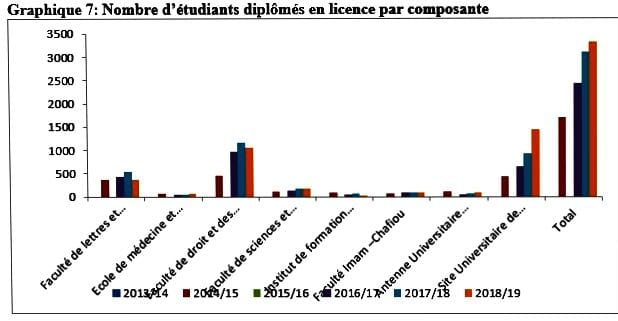

# Analyse statistique de l’évolution de l’enseignement universitaire aux Comores (2013–2020)

## Présentation

Ce projet présente une analyse statistique de l’évolution de l’enseignement universitaire aux Comores entre 2013 et 2019.  
Il a été réalisé dans le cadre de mon mémoire de DUT en statistique.

L’objectif est d’étudier les dynamiques d’évolution de l’enseignement supérieur à partir de données institutionnelles.

---

## Objectifs

- analyser l’évolution des effectifs étudiants
- étudier la répartition des étudiants par filière
- identifier les tendances d’évolution de l’enseignement supérieur

---

## Méthodologie

L’étude repose sur des méthodes de **statistique descriptive** et d’analyse de données éducatives, notamment :

- analyse des effectifs étudiants
- analyse de la distribution par filière
- analyse des tendances temporelles
- visualisation graphique des résultats

---

## Structure du projet

rapport/ → mémoire complet du projet  
synthese/ → résumé scientifique de la recherche  
graphiques/ → visualisations statistiques issues de l’étude  

---

## Visualisations principales

### Évolution des effectifs par composante (2013–2020)

> Le graphique montre une forte croissance des effectifs au site de Patsy au cours des quatre dernières années.  
> Patsy atteint un niveau comparable à la Faculté de Droit et des Sciences Économiques, avec environ 4 000 étudiants en moyenne.  
> La Faculté des Lettres et Sciences Humaines arrive ensuite, suivie par la Faculté des Sciences et Techniques.  
> Les composantes les moins fréquentées sont l’Institut de Formation des Enseignants (91 étudiants) et l’École de Médecine (189 étudiants) en 2019/2020.

---

### Diplômés DUT (2013–2019)

> L’Institut Universitaire de Technologie est la seule composante délivrant le diplôme de DUT (formation en deux ans).  
> Le nombre de diplômés fluctue fortement d’une année à l’autre.  
> Entre 2013 et 2019, environ 10 004 diplômes ont été délivrés.  
> Le volume est particulièrement élevé en 2013/2014, baisse en 2014/2015, remonte en 2015/2016, puis alterne entre hausse et baisse les années suivantes.  
> Ces variations suivent globalement l’évolution du nombre d’inscrits chaque année.

---

### Diplômés licence par composante (2013–2019)

> Le graphique montre que la Faculté de Droit et des Sciences Économiques enregistre le plus grand nombre de diplômés en licence (1 050 diplômés).  
> Elle est suivie par le site de Patsy, qui totalise 1 435 diplômés sur la période.  
> La Faculté des Lettres et Sciences Humaines arrive ensuite avec 378 diplômés.  
> Ces résultats reflètent les différences de capacité d’accueil, de choix d’orientation et de taux de réussite selon les composantes.

## Mémoire complet (PDF)

Vous pouvez consulter le mémoire complet ici :

 [Télécharger le mémoire DUT – Analyse statistique de l’enseignement supérieur](Rapport%20du%20Dut.pdf)

